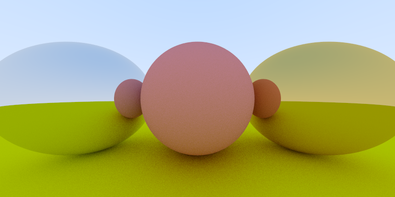

# strahl

A very basic raytracer based on the book 'A raytracer in a week'.

The result is written to a ppm image to avoid handling keys.
This is the result:

## References

https://github.com/RayTracing/raytracing.github.io
